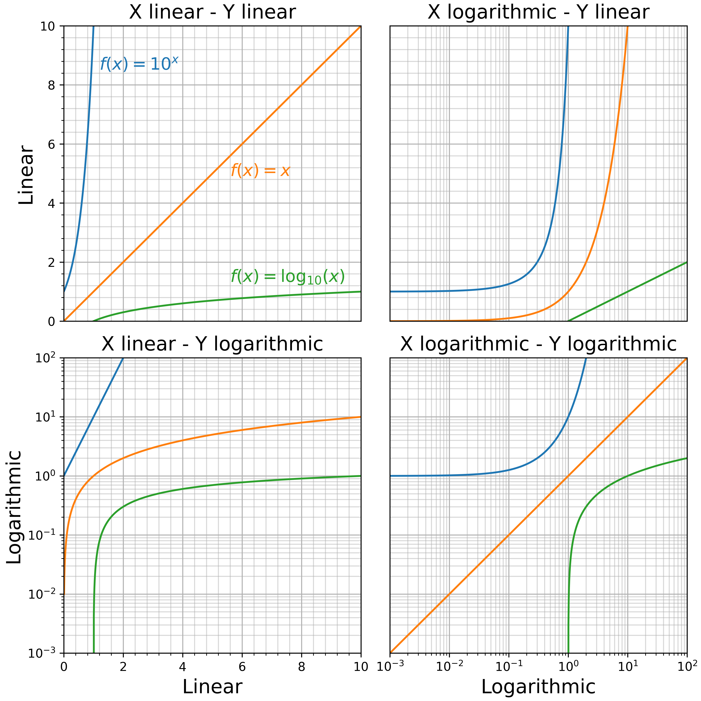
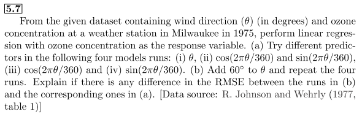
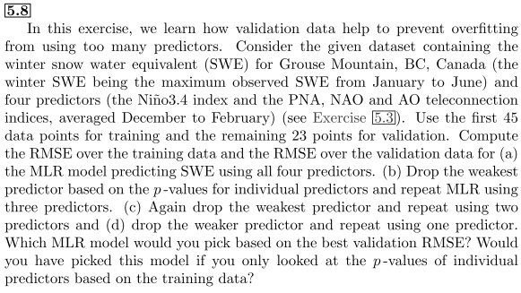
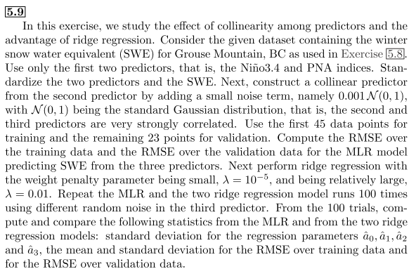

# Assignment_1

**Student Name:** 郭忠侑

## 1. Reproduce the figure for Q3 in the Pre-course Quiz.

This is my resulting image:

[Problem 1 code](https://github.com/weyltensor007/ncu-env-data-science/blob/main/Assignment_1/problem_1.py)

## 2. Exercise 5.7 in Hsieh’s book

Table of RMSE for different cases:

|      |      a |      b |
| :--- | -----: | -----: |
| i    | 20.396 | 28.220 |
| ii   | 19.765 | 19.765 |
| iii  | 28.194 | 23.636 |
| iv   | 20.587 | 23.458 |

### Caveat

When dealing with the case of $\theta'=\theta+60$, we need to do one more operation, that is the modular operation which makes the transformed angles lie in the correct range: $[0,360)$. More specifically, we let $\theta'=(\theta+60) \mod 360$.

### Discussion of the results

- although case a-i is not bad within case a, but using the parameter $\theta$ directly is unstable when adding a constant to it, we can see this effect in case b-i, which is the worst within case b.
- the RMSE values of case a-ii and b-ii are equivalent, this is not a coincidence, in fact, it is related to the fact that when one perform an invertible linear transformation on the predictor variables, the RMSE is invariant under such transformation. we can prove this fact in the following section.

### RMSE is invariant under an invertible linear transformation on the predictor variables

#### Why do we care about the linear transformation on the predictor variables?

Consider the predictor variables in case ii, denote $k=60^{\circ}$ and let $\theta$ being radians of the raw angular data, $\theta'=\theta+k$ being the shifted angle, then we have four predictors:

- Predictor 1 of case a:  $X^{a}_1=\cos(\theta)$
- Predictor 2 of case a:  $X^{a}_2=\sin(\theta)$
- Predictor 1 of case b:  $X^{b}_1=\cos(\theta+k)$
- Predictor 2 of case b:  $X^{b}_2=\sin(\theta+k)$

By trigonometric identities:

$$
\begin{cases}
X^{b}_1=\cos(k)\cdot X^{a}_1-\sin(k)\cdot X^{a}_2\\\\
X^{b}_2=\sin(k)\cdot X^{a}_1+\cos(k)\cdot X^{a}_2
\end{cases}
$$

which means we are essentially dealing with **linear transformation of the predictor variables**!

#### Transformation of the estimated parameters

Recall that for a model $y=X\beta$, we have:

- the estimated parameter $\hat{\beta}=(X^TX)^{-1}X^T y$

- the predicted response $\hat{y}=X\hat{\beta}$

Denote the transformed predictors $X'=TX$, in which the matrix $T$ encapsulates the transformation rule, the model now becomes $y=X'\beta'$, and similarly:

- the estimated parater $\hat{\beta'}=(X'^TX')^{-1}X'^T y$
- the predicted response $\hat{y'}=X'\hat{\beta'}$

By matrix algebra we can establish the relation between $\hat{\beta}$ and $\hat{\beta'}$

$$
\begin{align*}
    \hat{\beta'}&=(X'^TX')^{-1}X'^T y\\\\
    &=[(T^TX^TXT)^{-1}]T^TX^T y\\\\
    &=[T^{-1}(X^TX)^{-1}(T^T)^{-1}]T^TX^Ty\\\\
    &=T^{-1}(X^TX)^{-1}X^Ty\\\\
    &=T^{-1}\hat{\beta}
\end{align*}
$$

then we can show that $\hat{y'}=\hat{y}$

$$
\hat{y'}=X'\hat{\beta'}=XT(T^{-1}\hat{\beta})=X\hat{\beta}=\hat{y}
$$

since $\hat{y'}=\hat{y}$, the RMSE stays the same under transformation $T$.

By the way, when use a single component(say $\sin$ or $\cos$) will not guarantee that RMSE being invariant under shifting of angles, since it may introduce another component, roughly speaking:

$$
\sin(\theta+k)=\sin(\theta)\cos(k)+\sin(k)\cos(\theta)
$$

another independent variable $\cos(\theta)$ appears, this explains the fact that in case iii and iv the RMSE is not invariant.

[Problem 2 code](https://github.com/weyltensor007/ncu-env-data-science/blob/main/Assignment_1/problem_2.py)

## 3. Exercise 5.8 in Hsieh’s book

## 4. Exercise 5.9 in Hsieh’s book

