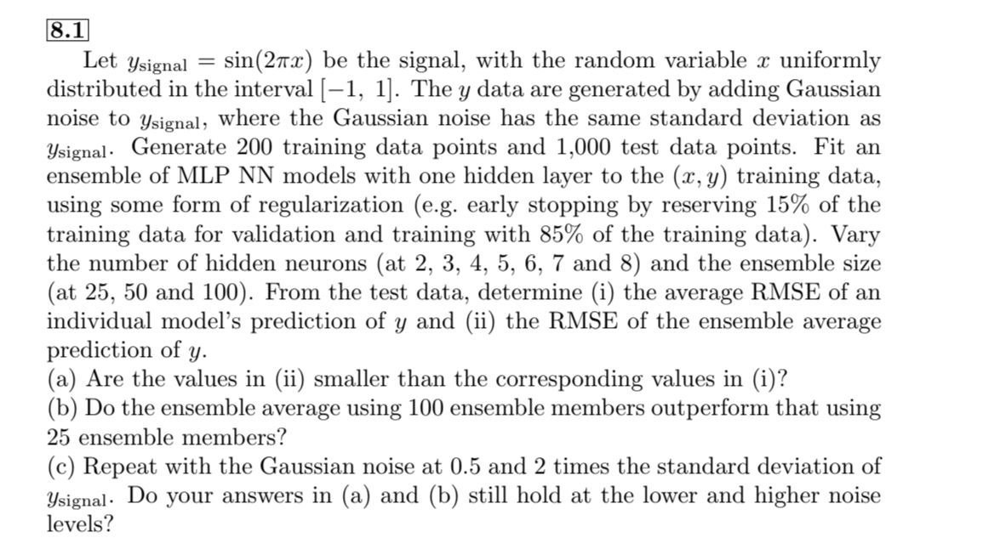

# Assignment_2

**Student Name:** 郭忠侑

## 1. Complete Exercise 6.5 in Hsieh’s book. Please build an MLP NN model and use the cross-validation technique to tune at least one model hyperparameter other than the learning rate.


I've chosen the ==number of hidden neurons==(n_hidden) as the hyperparameter of my ELM. Also, I did the 5-fold cross validation to select the best n_hidden as 5.
Here's my output result of cross validation(each item in CV rmse results means n_hidden vs. corresponding rmse):

```python
CV rmse results: {5: 490.816, 10: 526.899, 20: 1781.641, 50: 34675.982, 100: 15026.577}
Best n_hidden: 5
```

Finally, let's compare the rmse and the correlation coefficient between the ELM and MLR:

```python
rmse_ELM_ensembles=492.876, rmse_MLR=519.302
corr_ELM_ensembles=0.493, corr_MLR=0.37
```

It's easy to observe that rmse is lower and corr is higher for ELM, indicating it's a better model than the LMR.

[Problem1 Code](https://github.com/weyltensor007/ncu-env-data-science/blob/main/Assignment_2/problem1.py)

<div class="page"></div>

## 2. Complete Exercise 8.1 in Hsieh’s book. Please tune the learning rate for the MLP NN model.



I used `Keras` to build and train NN models, in particular, using the `callbacks.EarlyStopping` utility helped the tuning of the learning rate. Also, the training of NN models take time, so I split the workflow into 2 steps, namely train/pred and evaluation by saving the predicting values as `npy` file. Finally here is my full resulting table:

note:

- avg_rmse: in an ensemble, for each y_pred, calculate rmse, and then calculate avg(rmse)
- ensemble_emse: in an ensemble, calculate avg(y_pred), and then calculate its rmse

|      | sigma          | n_hidden | n_ensemble | avg_rmse | ensemble_rmse |     best_lr |
| ---: | :------------- | -------: | ---------: | -------: | ------------: | ----------: |
|    0 | noise-0.5sigma |        2 |         25 |  23.3782 |       23.2505 | 0.000259294 |
|    1 | noise-0.5sigma |        2 |         50 |  21.8022 |       20.8957 | 0.000259294 |
|    2 | noise-0.5sigma |        2 |        100 |  26.4893 |       24.8314 | 1.61026e-05 |
|    3 | noise-0.5sigma |        3 |         25 |  24.4425 |       24.1905 | 3.56225e-05 |
|    4 | noise-0.5sigma |        3 |         50 |  24.4663 |            24 | 5.29832e-05 |
|    5 | noise-0.5sigma |        3 |        100 |  17.8284 |       14.9309 |         0.1 |
|    6 | noise-0.5sigma |        4 |         25 |  23.8701 |       23.8362 | 2.39503e-05 |
|    7 | noise-0.5sigma |        4 |         50 |  16.9993 |       15.2766 |  0.00923671 |
|    8 | noise-0.5sigma |        4 |        100 |   26.538 |       25.0681 |  0.00621017 |
|    9 | noise-0.5sigma |        5 |         25 |  25.3555 |       24.6693 | 7.27895e-06 |
|   10 | noise-0.5sigma |        5 |         50 |  16.5668 |       16.4842 |   0.0452035 |
|   11 | noise-0.5sigma |        5 |        100 |  24.4073 |       24.1205 |  0.00011721 |
|   12 | noise-0.5sigma |        6 |         25 |  24.0951 |       23.9904 | 2.39503e-05 |
|   13 | noise-0.5sigma |        6 |         50 |  12.7082 |       12.6402 |   0.0672336 |
|   14 | noise-0.5sigma |        6 |        100 |  24.1184 |       23.9754 |       1e-06 |
|   15 | noise-0.5sigma |        7 |         25 |  23.8388 |       23.8353 | 3.56225e-05 |
|   16 | noise-0.5sigma |        7 |         50 |  16.9012 |       16.1963 | 0.000259294 |
|   17 | noise-0.5sigma |        7 |        100 |  25.7091 |       24.3466 |  0.00280722 |
|   18 | noise-0.5sigma |        8 |         25 |  25.4185 |       24.2305 | 1.48735e-06 |
|   19 | noise-0.5sigma |        8 |         50 |  17.1544 |       17.1466 |   0.0137382 |
|   20 | noise-0.5sigma |        8 |        100 |  13.0915 |       12.9384 |         0.1 |
|   21 | noise-1sigma   |        2 |         25 |  33.3813 |       31.3964 | 0.000174333 |
|   22 | noise-1sigma   |        2 |         50 |  27.9583 |       25.6886 |  0.00280722 |
|   23 | noise-1sigma   |        2 |        100 |   26.031 |       25.9017 |   0.0137382 |
|   24 | noise-1sigma   |        3 |         25 |  29.7305 |       29.5679 | 0.000385662 |
|   25 | noise-1sigma   |        3 |         50 |  30.8486 |       30.8301 | 2.39503e-05 |
|   26 | noise-1sigma   |        3 |        100 |    30.81 |       30.7858 | 1.48735e-06 |
|   27 | noise-1sigma   |        4 |         25 |  31.0964 |        31.094 | 3.29034e-06 |
|   28 | noise-1sigma   |        4 |         50 |   23.371 |       23.3494 |         0.1 |
|   29 | noise-1sigma   |        4 |        100 |  26.5657 |       25.5499 |  0.00188739 |
|   30 | noise-1sigma   |        5 |         25 |  32.2665 |       31.7617 |  0.00280722 |
|   31 | noise-1sigma   |        5 |         50 |  31.8778 |       31.3293 | 1.08264e-05 |
|   32 | noise-1sigma   |        5 |        100 |  31.1727 |        31.153 | 3.56225e-05 |
|   33 | noise-1sigma   |        6 |         25 |  25.9683 |       25.5905 |  0.00126896 |
|   34 | noise-1sigma   |        6 |         50 |  26.9496 |       25.8542 |  0.00188739 |
|   35 | noise-1sigma   |        6 |        100 |  26.6801 |       26.4703 |         0.1 |
|   36 | noise-1sigma   |        7 |         25 |  23.5906 |       23.4312 |         0.1 |
|   37 | noise-1sigma   |        7 |         50 |  30.9757 |        30.973 |    0.030392 |
|   38 | noise-1sigma   |        7 |        100 |  23.4616 |       23.4177 | 1.08264e-05 |
|   39 | noise-1sigma   |        8 |         25 |  26.0009 |       25.9177 |  0.00126896 |
|   40 | noise-1sigma   |        8 |         50 |   30.262 |       30.2165 |   0.0672336 |
|   41 | noise-1sigma   |        8 |        100 |  31.0681 |       31.0671 | 7.88046e-05 |
|   42 | noise-2sigma   |        2 |         25 |  48.3115 |        47.804 |  0.00126896 |
|   43 | noise-2sigma   |        2 |         50 |  48.0483 |       46.7206 |   0.0452035 |
|   44 | noise-2sigma   |        2 |        100 |  51.2101 |       49.8417 | 2.21222e-06 |
|   45 | noise-2sigma   |        3 |         25 |  50.4188 |       50.0577 | 1.61026e-05 |
|   46 | noise-2sigma   |        3 |         50 |  47.0717 |       45.7904 |  0.00417532 |
|   47 | noise-2sigma   |        3 |        100 |  49.8791 |       49.7953 |  4.8939e-06 |
|   48 | noise-2sigma   |        4 |         25 |  50.3468 |       50.0683 |  0.00188739 |
|   49 | noise-2sigma   |        4 |         50 |  49.7143 |       49.7104 |   0.0204336 |
|   50 | noise-2sigma   |        4 |        100 |   51.955 |       50.3372 |         0.1 |
|   51 | noise-2sigma   |        5 |         25 |  49.8459 |       49.7974 | 0.000259294 |
|   52 | noise-2sigma   |        5 |         50 |  49.8696 |       49.7575 |         0.1 |
|   53 | noise-2sigma   |        5 |        100 |  51.0832 |       49.8741 |   0.0672336 |
|   54 | noise-2sigma   |        6 |         25 |  49.5725 |       49.5682 |         0.1 |
|   55 | noise-2sigma   |        6 |         50 |  47.1561 |       47.0253 |    0.030392 |
|   56 | noise-2sigma   |        6 |        100 |  49.7303 |       49.7278 |         0.1 |
|   57 | noise-2sigma   |        7 |         25 |  47.0183 |       46.9967 |    0.030392 |
|   58 | noise-2sigma   |        7 |         50 |   47.179 |       47.0493 |   0.0452035 |
|   59 | noise-2sigma   |        7 |        100 |  51.4086 |       50.1199 |   0.0204336 |
|   60 | noise-2sigma   |        8 |         25 |  47.2009 |       46.9837 |         0.1 |
|   61 | noise-2sigma   |        8 |         50 |  46.8958 |       46.8475 |         0.1 |
|   62 | noise-2sigma   |        8 |        100 |  47.1671 |       46.9541 | 7.88046e-05 |


### Some discussions

1. Answering (a): Yes, `ensemble_rmse` are almost always less than `avg_rmse`, indicating that ensemble method does reduce prediction error. Hence it's more meaningful to talk about the `ensemble_rmse`.
2. Answering (b): For `0.5sigma`, `n_ensemble`=100 is not better than `n_ensemble`=25, as indicating by the row index=0(25 ensemble_rmse=23.2505) versus row index=2(100 ensemble_rmse=24.8314)
3. Answering (c): (a), (b) still hold within different noise levels.
4. There seems no clear pattern in the `best_lr` with respect to the number of hidden neurons.
5. `ensemble_rmse` increases as noise level increases, which is fairly reasonable.


[Problem 2 train/pred code](https://github.com/weyltensor007/ncu-env-data-science/blob/main/Assignment_2/problem2_pred.py)

[Problem 2 evaluation code](https://github.com/weyltensor007/ncu-env-data-science/blob/main/Assignment_2/problem2_evaluation.py)


<div class="page"></div>


## 3. Visualize the regression results of Exercise 8.1 at least for the case with the Gaussian noise at 0.5 times the standard deviation of $y_{\text{signal}}$
