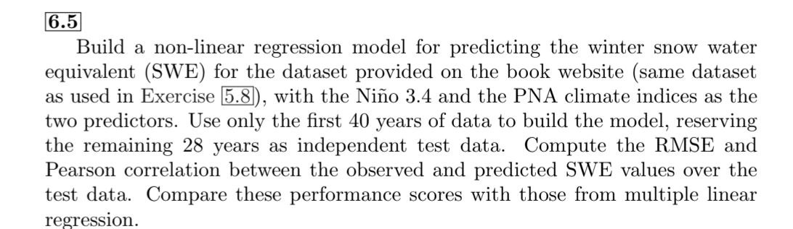

# Assignment_2

**Student Name:** 郭忠侑

## 1. Complete Exercise 6.5 in Hsieh’s book. Please build an MLP NN model and use the cross-validation technique to tune at least one model hyperparameter other than the learning rate.



I've chosen the ==number of hidden neurons==(n_hidden) as the hyperparameter of my ELM. Also, I did the 5-fold cross validation to select the best n_hidden as 5.
Here's my output result of cross validation(each item in CV rmse results means n_hidden vs. corresponding rmse):

```python
CV rmse results: {5: 490.816, 10: 526.899, 20: 1781.641, 50: 34675.982, 100: 15026.577}
Best n_hidden: 5
```

Finally, let's compare the rmse and the correlation coefficient between the ELM and MLR:

```python
rmse_ELM_ensembles=492.876, rmse_MLR=519.302
corr_ELM_ensembles=0.493, corr_MLR=0.37
```

It's easy to observe that rmse is lower and corr is higher for ELM, indicating it's a better model than the LMR.

<div class="page"></div>

## 2. Complete Exercise 8.1 in Hsieh’s book. Please tune the learning rate for the MLP NN model.


<div class="page"></div>

## 3. Visualize the regression results of Exercise 8.1 at least for the case with the Gaussian noise at 0.5 times the standard deviation of $y_{\text{signal}}$
