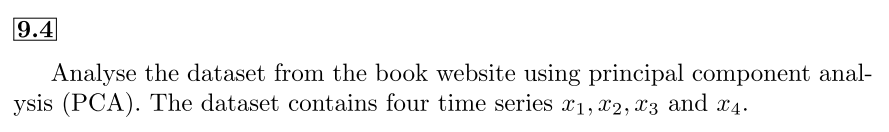
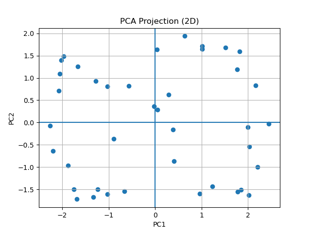

# Assignment_3

**Student Name:** 郭忠侑

## 1. Complete Exercise 9.4 in Hsieh’s book. Please visualize the data and/or results in some ways.

I've used `sklean` to do PCA in this assignment. The eigenvectors for PCA are

|     | PC1       | PC2       | PC3       | PC4       |
| --- | --------- | --------- | --------- | --------- |
| x1  | 0.513685  | -0.469876 | 0.682832  | 0.221550  |
| x2  | 0.405938  | 0.627278  | -0.087502 | 0.658847  |
| x3  | -0.553820 | -0.409653 | -0.098287 | 0.718198  |
| x4  | -0.514417 | 0.466823  | 0.718626  | -0.032063 |

The explained variances by each PCs are: `[0.59785561 0.37827087 0.01810953 0.005764]`.

It's evident that we can reduce the dimension of data down to 2, and then plot the scatter plot as below:

[Problem1 Code](https://github.com/weyltensor007/ncu-env-data-science/blob/main/Assignment_3/problem1.py)

## 2. Complete Exercise 9.5 in Hsieh’s book. Please visualize the data and/or results in some ways.

