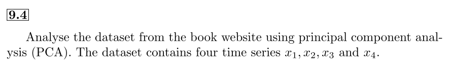
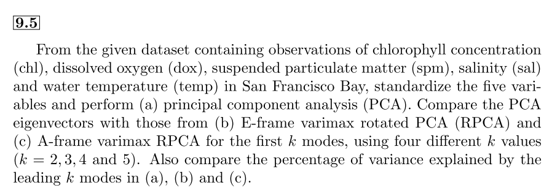

# Assignment_3

**Student Name:** 郭忠侑

## 1. Complete Exercise 9.4 in Hsieh’s book. Please visualize the data and/or results in some ways.




I've used `sklean` to do PCA in this assignment. The eigenvectors for PCA are

|     | PC1       | PC2       | PC3       | PC4       |
| --- | --------- | --------- | --------- | --------- |
| x1  | 0.513685  | -0.469876 | 0.682832  | 0.221550  |
| x2  | 0.405938  | 0.627278  | -0.087502 | 0.658847  |
| x3  | -0.553820 | -0.409653 | -0.098287 | 0.718198  |
| x4  | -0.514417 | 0.466823  | 0.718626  | -0.032063 |

The explained variances by each PCs are: `[0.59785561 0.37827087 0.01810953 0.005764]`.

It's evident that we can reduce the dimension of data down to 2, and then plot the scatter plot as below:

\begin{figure}[H]
\centering
\includegraphics[width=1.0\linewidth]{imgs/problem1.png}
\end{figure}

[Problem1 Code](https://github.com/weyltensor007/ncu-env-data-science/blob/main/Assignment_3/problem1.py)

\newpage


## 2. Complete Exercise 9.5 in Hsieh’s book. Please visualize the data and/or results in some ways.



### Algorithms for solving A-frame/E-frame varimax

For the varimax(take E-frame for example), the textbook only gave criteria but without explicit algorithm:

$$
R_{\text{varimax}} = \mathop{\arg\max}\limits_{R}L(R;A)= \mathop{\arg\max}\limits_{R}
\sum_{j=1}^{k}\left\{\sum_{i=1}^{n}(\tilde{A_{ij}})^4
-\dfrac{1}{n}\left(\sum_{i=1}^{n}(\tilde{A_{ij}})^2\right)^2\right\}
$$


where $\tilde{A_{ij}}$ is the element of the matrix $\tilde{A}=AR$, and $k$ is the number of dimension we choose, in which I have always follow the notation of the textbook as much as possible.

By asking `ChatGPT`, it gave me an algorithm for varimax as follows:

1. Initialize $R_{0}=I_k$
2. compute $\nabla_R L(R;A)=P(R;A)$, where $P(R;A)$ can be derived as matrix representation:

    $$
    P(R;A)=A^T\left[\tilde{A}^{3(\text{ele})}-\dfrac{1}{\text{\# rows of A}}\tilde{A}(\text{diag}(\tilde{A}^T \tilde{A}))\right]
    $$


    $\tilde{A}^{3(\text{ele})}$ means element wise cubed

    $diag(M)$ means the diagonal terms of $M$ and keep the dimension of $M$, for example
    $$
    \text{diag}\left(\begin{bmatrix}
        1\ 2\ 3\\
        4\ 5\ 6\\
        7\ 8\ 9
    \end{bmatrix}\right)=\begin{bmatrix}
        1\ 0\ 0\\
        0\ 5\ 0\\
        0\ 0\ 9
    \end{bmatrix}
    $$
3. do svd of $P=U\Sigma V^{T}$
4. update $R$ by $R=UV^T$
5. repeat until $\text{trace}({\Sigma})$ makes little progress

In fact, this algorithm is also used by [sklearn _ortho_rotation function](https://github.com/scikit-learn/scikit-learn/blob/main/sklearn/decomposition/_factor_analysis.py#L438).

I will include some more detailed derivation on this in other notes.


### Explained variance ratio for different k

Once we've obtained the varimax rotation matrix $R$, compute $\tilde{A}=AR$ and then $\tilde{S}=(\tilde{A}^T A)/(n-1)$, the explained variances along the new axis are the diagonal terms in $S$, namely  $\text{diag}({S})$, and here's the results:

```python
k=2
PCA_variance=[0.453 0.248]
E-frame_variance=[0.385 0.317]
A-frame_variance=[0.415 0.287]
k=3
PCA_variance=[0.453 0.248 0.142]
E-frame_variance=[0.312 0.212 0.32 ]
A-frame_variance=[0.359 0.215 0.27 ]
k=4
PCA_variance=[0.453 0.248 0.142 0.117]
E-frame_variance=[0.305 0.209 0.299 0.148]
A-frame_variance=[0.252 0.207 0.271 0.23 ]
k=5
PCA_variance=[0.453 0.248 0.142 0.117 0.04 ]
E-frame_variance=[0.297 0.198 0.302 0.148 0.056]
A-frame_variance=[0.2 0.2 0.2 0.2 0.2]
```

### Some plots

\begin{figure}[H]
\centering
\includegraphics[width=1.2\linewidth]{imgs/components_of_eigenvectors.png}
\end{figure}


\begin{figure}[H]
\centering
\includegraphics[width=1.0\linewidth]{imgs/explained_variances_ratio.png}
\end{figure}


### Some discussion

- The ordering relation for explained variances is not always preserved. Take k=2 for example, var1(pca)>var1(e-frame), but var2(pca)<var2(e-frame).
- For A-frame rotation, as its objective function behaves, it makes some components of column vectors in $\tilde{E}$ to be zero, as can be clearly seen from the case of k=5(A-frame) diagram.
- The components plot varies with k for the rotated PCA, while it does not for the ordinary PCA, since for different k, it will introduce different variance effect into the objective function of the varimax.


[Problem2 Code](https://github.com/weyltensor007/ncu-env-data-science/blob/main/Assignment_3/problem2.py)