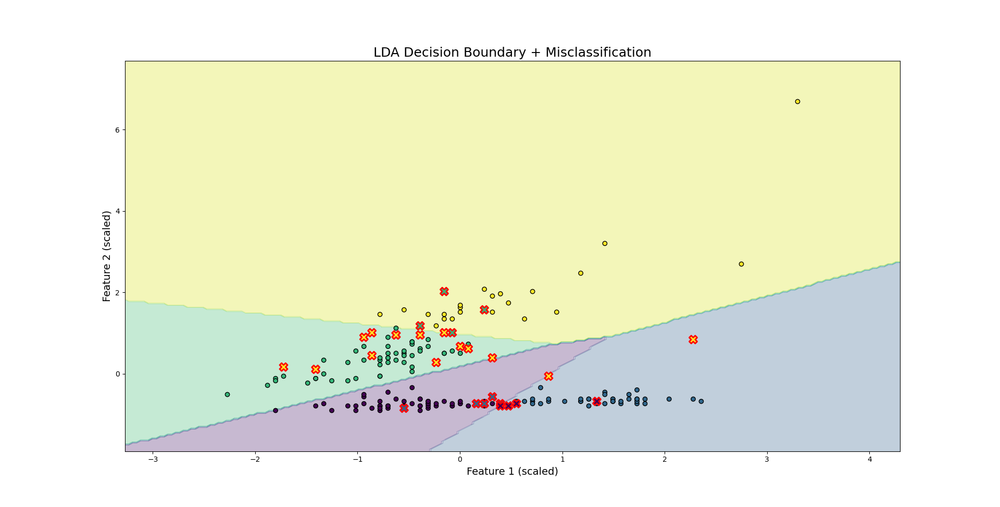
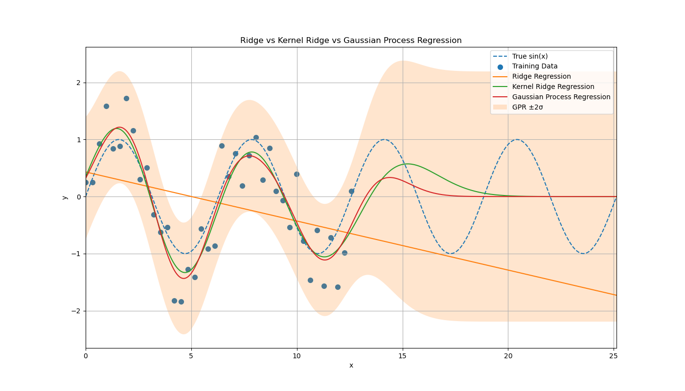

# Assignment_4

**Student Name:** 郭忠侑

## 1. Complete Exercise 12.1 in Hsieh’s book. For subquestion (a), visualize the results to reproduce Figure 12.1(b). Make sure to label/mark correct and incorrect predictions.

I've used the sklean package to run the LDA model, the misclassification rates for both training and test data with different numbers of features are:

n_cols=2: miss_rate_train=0.1414, miss_rate_test=0.1969
n_cols=4: miss_rate_train=0.1414, miss_rate_test=0.2492
n_cols=6: miss_rate_train=0.0909, miss_rate_test=0.1969
n_cols=27: miss_rate_train=0.0202, miss_rate_test=0.1723

It seems that utilizing all features works best for this dataset!

Below is the plot of decision boundaries and scatter plots for the case of number of features=2, note that the points with red cross edges represent the wrongly classified points.

## 3. Generate a synthetic signal with added noise $y=\sin(x)+0.5\times \mathcal{N}(0,1)$ and collect 40 data points that are distributed within the range . Now use (a) ridge regression, (b) kernel ridge regression, and (c) Gaussian process regression to model the data and give the prediction in the range with visualization. Describe and justify your kernel selection and hyperparameter tuning process whenever necessary. Compare the results from three regression methods.

Discussions:

1. Ridge Regression

    Ridge regression captured only the linear pattern of training data, making it unsuitable for this scenario, unless we use polynomial ridge regression.
    The polynomial ridge regression may induce the exploding problem for the extrapolation.
2. Kernel Ridge Regression

    Kernel ridge regression applies the kernel trick to implicitly map inputs into a high-dimensional feature space.
    The RBF kernel assumes strong smoothness and locality, which allows it to approximate sinusoidal functions within the observed domain.
    Although it performs well in the training region, it fails to capture the periodicity, which leads to poor performance in the testing region.
3. Gaussian Process Regression
    Gaussian Process Regression defines a distribution over functions. The RBF kernel encodes smoothness assumptions, while the WhiteKernel models observation noise. Although its predictive behavior is similar to kernel ridge regression, it additionally provides uncertainty estimates, making it especially useful for understanding confidence in predictions.
